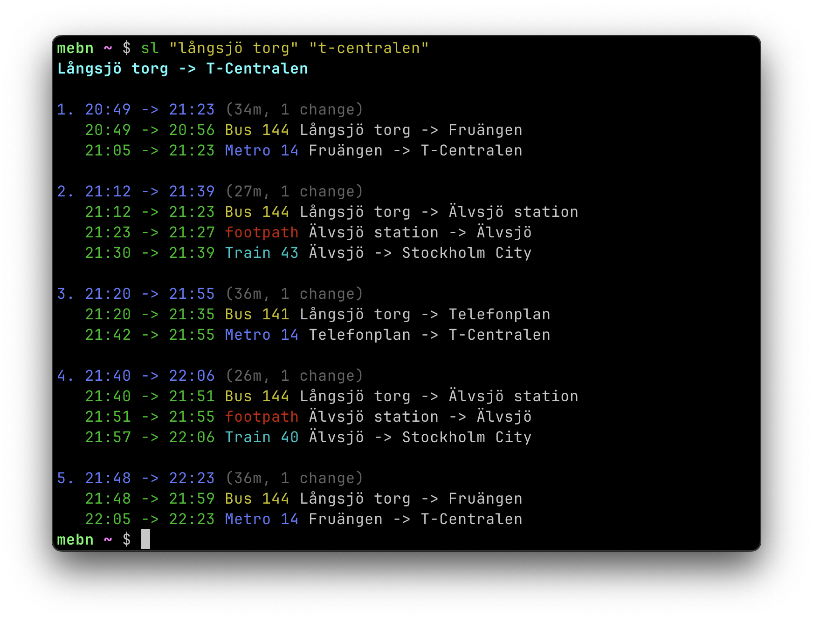

# SL

CLI for quickly fetching upcoming SL public transit trips between two places.

<p align="center">
  
</p>

## Install

```bash
go install github.com/mebn/sl@latest
```

Make sure your Go bin directory is in your `PATH`. Add `export PATH=$PATH:$HOME/go/bin` to your `.bashrc`/`.zshrc`.

### Upgrade

To upgrade the package, run `sl -u` or `sl --upgrade`.

## Usage

- `sl <from> <to>`: fetch upcoming route alternatives from `from` to `to`.
- `sl -s <from> <to>`: same as above, and saves route as default.
- `sl`: uses saved default route.
- `sl -r`: reverses route direction (`to -> from`) for saved route or provided args.
- `sl -u` / `sl --upgrade`: runs `go install github.com/mebn/sl`.
- `sl -h` / `sl --help`: shows help.

Flags can be placed before or after route arguments.
